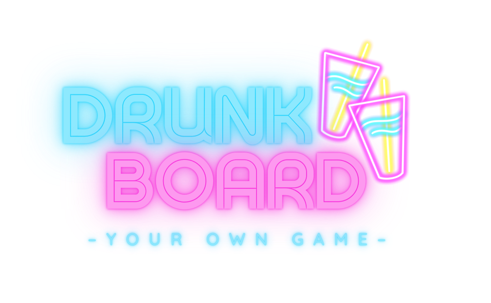

# Drunk Board

**Drunk Board** es una divertida adaptación del clásico juego de la OCA, diseñado para jóvenes. ¡Conéctate a partidas en línea y desafía a tus amigos en un emocionante juego donde cada casilla es un reto y los tableros son totalmente personalizables!

## 🚀 Características Principales

- **Partidas en línea**: Juega en tiempo real con amigos o jugadores de todo el mundo gracias a Socket.IO.
- **Personalización de tableros**: Crea y modifica tableros únicos con tus propios retos y reglas.
- **Retos emocionantes**: Cada casilla del tablero presenta un desafío que los jugadores deben completar, añadiendo un toque de diversión y sorpresa.
- **Interacción en tiempo real**: Chat en vivo y notificaciones para mantener la emoción durante el juego.
- **Fácil acceso**: Disponible en dispositivos móviles gracias a Ionic, para que puedas jugar donde quieras.

## 🛠️ Tecnologías Utilizadas

- **Framework**: Ionic
- **Servidor**: Node.js
- **WebSocket**: Socket.IO para comunicación en tiempo real
- **Frontend**: Angular
- **Base de Datos**: Puedes integrar la base de datos que prefieras (MongoDB, MySQL, etc.) para almacenar usuarios, tableros y partidas.

## 🎯 Objetivo

Drunk Board busca ofrecer una experiencia de juego divertida y social, combinando la nostalgia del juego de la OCA con la interacción moderna en línea. ¡Desafía a tus amigos, completa retos y personaliza tu experiencia de juego!

## 👾 Juega Ahora

Reúne a tus amigos y sumérgete en la diversión de Drunk Board, donde cada partida es única y cada reto puede llevarte a la victoria o a una divertida sorpresa.

---

Contribuye a **Drunk Board** con tus ideas, mejoras o reportando cualquier problema. ¡Estamos aquí para hacer del juego una experiencia aún más emocionante!
